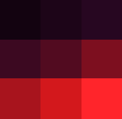
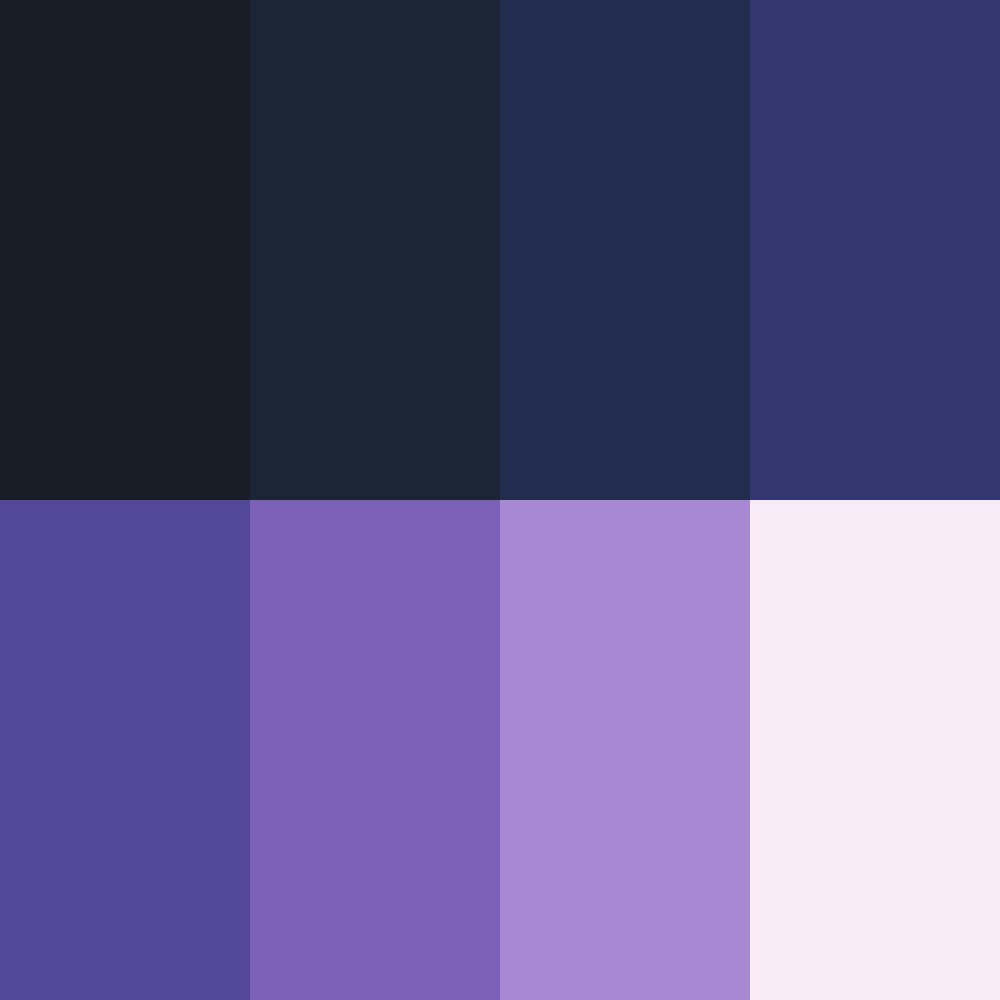

<h1 align="center">
  <br/>
  Img2Palette
</h1>

<p align="center">
  
  
  
  
</p>

<div align="center">
A browser-based tool for extracting color palettes from images. Runs client-side with no external dependencies, supporting custom palette sizes, color sorting, swatch editing, and multi-format export.
</div>

<br/>

<div align="center">
  <table>
    <tr>
      <th style="text-align: center">Original</th>
      <th style="text-align: center">Extracted Palette</th>
    </tr>
    <tr>
      <td></td>
      <td></td>
    </tr>
  </table>
</div>

---

## Quick Start

### 1. GitHub Pages (Online)

Use the hosted version directly in your browser [here](https://meangrinch.github.io/Img2Palette/).

### 2. Standalone (Offline)

Download `Img2Palette.html` from [Releases](https://github.com/meangrinch/Img2Palette/releases) or the repository root and open it in any browser.

### 3. From Source

```bash
git clone https://github.com/meangrinch/Img2Palette.git
cd Img2Palette
python scripts/build.py
```

---

## Features

- **Extraction**: Extract 1 to 256 colors from images with K-Means++, Wu, or Median Cut, preserving small accent colors
- **Sorting**: Order palettes into smooth color gradients while preserving locked swatches
- **Organization**: Arrange swatches by hue spectrum or lightness with separated neutral tones
- **Swatch Editor**: Click to copy hex codes, lock favorite colors, edit or remove swatches, and sample new ones with the eyedropper
- **Preview**: Compare the image and palette side by side or view the palette alone, with an eyedropper loupe and up to 3200% zoom
- **Export**: Save as PNG swatches (strip, grid, or preview layout), JSON, GPL, CSS variables, or hex lists, or copy to the clipboard

---

## Support the Project

Img2Palette is open-source and free. If it saves you time or enhances your workflow, consider supporting its development!

<p align="center">
  <a href="https://ko-fi.com/grinnch" target="_blank">
    
  </a>
</p>

---

## License & Credits

- License: Apache-2.0 (see [LICENSE](LICENSE))
- Author: [grinnch](https://github.com/meangrinch)
