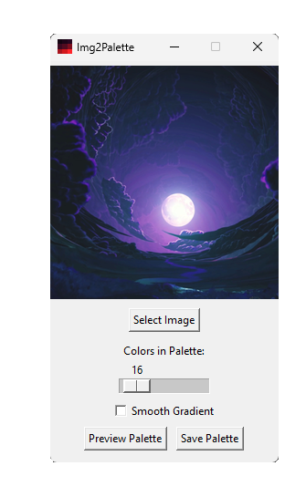

# Img2Palette

A simple program that generates a color palette from an image.

## Features

- Select an image file (various formats supported).
- Adjust the number of colors in the generated palette (up to 256).
- Enable "Smooth Gradient" to only keep colors that form a smooth gradient (auto limits to MST diameter).
- Palettes are sorted by their perceptual color difference.
- Palettes are outputted as a PNG file (3x3px swatch size)

## Notes

Use arrow keys / click within the trough to fine tune the slider position.
